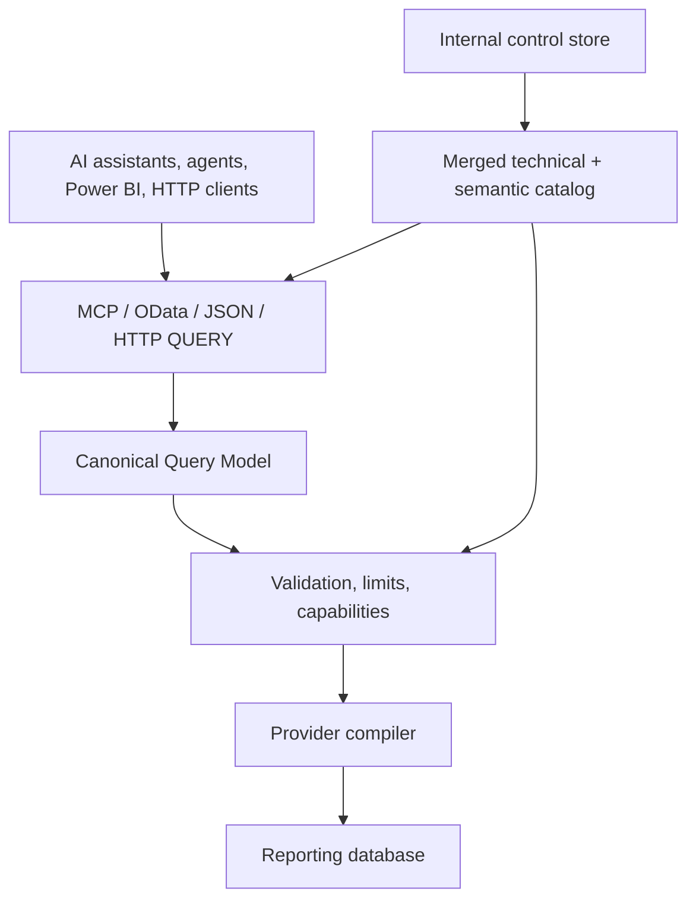

# AI Data Gateway — Project Handoff

> Working title; final repository and product name are still to be chosen.
>
> Architecture baseline: 2026-07-18  
> Primary stack: .NET 10 / ASP.NET Core  
> Initial target: a public GitHub repository with a downloadable, working v1

## 1. Purpose

This is the authoritative handoff for designing and implementing a new open-source gateway that exposes relational data to frontier AI assistants, agents, OData clients, and ordinary HTTP clients.

It is intended to be given directly to Codex. Treat the architectural boundaries, non-goals, security constraints, public contracts, and release sequence as settled unless the project owner explicitly changes them.

This is a new project. It is conceptually related to `llama-mcp` because both are remote MCP servers written in .NET, but it must live in a separate repository and solution.

## 2. Product definition

The product is a self-hosted, read-only data gateway for advanced reporting through AI assistants and agents.

An administrator deploys a .NET web application, supplies a reporting database connection string, optionally supplies human and machine-readable catalog documentation, and configures authentication. The application introspects the database and exposes catalog and query capabilities through:

- MCP over Streamable HTTP;
- a read-only OData 4.01 profile;
- a versioned JSON query API;
- HTTP `QUERY`, with `POST` as compatibility fallback.

The gateway does not generate reports itself. It supplies catalog information, relationships, data, aggregation operators, and safe query execution to ChatGPT, Claude, Codex, other assistants, autonomous agents, Power BI, and other reporting clients.

Core proposition:

> Give AI assistants flexible, deterministic, read-only access to relational data without raw SQL, a static ORM source model, or business-reporting logic embedded in the connector.

## 3. Explicit non-goals

The following are outside the product boundary:

- no writes;
- no `INSERT`, `UPDATE`, `DELETE`, `MERGE`, DDL, or arbitrary commands;
- no stored procedure, UDF, trigger, sequence, or programmable-object exposure;
- no caller-supplied raw SQL or LLM-generated free SQL;
- no BI dashboard builder;
- no charts or file-export engine;
- no semantic model of facts and dimensions;
- no certified metric registry;
- no saved queries or reports;
- no per-user row/column authorization in v1;
- no masking in v1;
- no query-result cache initially;
- no OLE DB unless a future concrete request justifies it.

Metrics, reusable analytical logic, and reusable reports belong to the caller. They may live in chats, projects, agent instructions, applications, or client-side skills. The gateway remains a flexible transport and query layer.

## 4. Architectural principles

1. **Read-only by construction.** The public model cannot represent a write, and the provider compiler emits one parameterized `SELECT`.
2. **One logical query model.** MCP, OData, JSON, HTTP `QUERY`, and future GraphQL translate into the same Canonical Query Model.
3. **No static ORM for source data.** Runtime schema discovery is mandatory. EF Core is allowed only for the internal control store.
4. **Foreign keys are hints, not restrictions.** An explicit join condition always overrides formal FK metadata.
5. **Two-level catalog.** Technical metadata is introspected; domain prose and structured annotations are administrator supplied.
6. **Files are import/export artifacts.** Runtime state comes from the control store, not scattered local files.
7. **Capabilities are explicit.** Unsupported behavior fails clearly and is never approximated silently.
8. **Small MCP surface.** Do not create one tool per table.
9. **Token-efficient results.** Return columns once and compact row arrays for MCP/JSON.
10. **Portable hosting.** Run as a normal .NET 10 web app in containers, PaaS, VMs, or home servers.

## 5. High-level architecture



Runtime layers:

- **Host:** ASP.NET Core, configuration, proxies, health, administration.
- **Authentication:** standalone OAuth with authorization code + PKCE through OpenIddict; external OIDC/Entra later.
- **Protocol adapters:** MCP, OData, JSON, HTTP `QUERY`; GraphQL later.
- **Catalog:** SQL Server introspection, YAML overlay, Markdown guide, validation, in-memory search.
- **Query core:** Canonical Query Model (CQM), normalization, type inference, validation, limits.
- **Provider:** introspector, compiler, type mapper, parameters, capabilities.
- **Control store:** SQLite v1; SQL Server and scale-out later.

## 6. Canonical Query Model

The CQM is a versioned, provider-neutral representation of a read query. Protocol parsers may have their own AST, but all translate into this model before validation or execution.

### 6.1 Root query

```json
{
  "version": "1.0",
  "from": {
    "entity": "sales.Invoices",
    "alias": "i"
  },
  "joins": [],
  "select": [],
  "where": null,
  "groupBy": [],
  "having": null,
  "orderBy": [],
  "distinct": false,
  "page": {
    "limit": 100,
    "offset": 0
  },
  "includeTotalCount": false
}
```

There is no explicit query type. Presence of an aggregate, `groupBy`, or `having` classifies the query as analytical; otherwise it is an entity/detail query.

### 6.2 Expression union

Each expression is exactly one form.

Field:

```json
{ "field": "i.NetAmount" }
```

Literal:

```json
{ "value": 1000 }
```

Typed literal:

```json
{ "value": "2026-01-01", "type": "date" }
```

Alias reference, initially only in `having` and `orderBy`:

```json
{ "alias": "totalAmount" }
```

Operator:

```json
{
  "operator": "multiply",
  "arguments": [
    { "field": "l.Quantity" },
    { "field": "l.UnitPrice" }
  ]
}
```

Function:

```json
{
  "function": "dateTrunc",
  "arguments": [
    { "value": "month" },
    { "field": "i.PostingDate" }
  ]
}
```

Aggregate:

```json
{
  "aggregate": "sum",
  "expression": { "field": "i.NetAmount" },
  "distinct": false
}
```

Row count:

```json
{ "aggregate": "count" }
```

Distinct count:

```json
{
  "aggregate": "count",
  "expression": { "field": "i.CustomerId" },
  "distinct": true
}
```

Every literal becomes a database parameter.

### 6.3 Entity query example

```json
{
  "version": "1.0",
  "from": {
    "entity": "sales.Invoices",
    "alias": "i"
  },
  "select": [
    {
      "expression": { "field": "i.Id" },
      "alias": "invoiceId"
    },
    {
      "expression": { "field": "i.PostingDate" },
      "alias": "postingDate"
    },
    {
      "expression": { "field": "i.NetAmount" },
      "alias": "netAmount"
    }
  ],
  "where": {
    "operator": "and",
    "arguments": [
      {
        "operator": "ge",
        "arguments": [
          { "field": "i.PostingDate" },
          { "value": "2026-01-01", "type": "date" }
        ]
      },
      {
        "operator": "gt",
        "arguments": [
          { "field": "i.NetAmount" },
          { "value": 10000 }
        ]
      }
    ]
  },
  "orderBy": [
    {
      "expression": { "field": "i.NetAmount" },
      "direction": "desc"
    }
  ],
  "page": {
    "limit": 100,
    "offset": 0
  }
}
```

### 6.4 Analytical query example

```json
{
  "version": "1.0",
  "from": {
    "entity": "sales.InvoiceLines",
    "alias": "l"
  },
  "joins": [
    {
      "type": "inner",
      "source": {
        "entity": "sales.Invoices",
        "alias": "i"
      },
      "on": {
        "operator": "eq",
        "arguments": [
          { "field": "l.InvoiceId" },
          { "field": "i.Id" }
        ]
      }
    },
    {
      "type": "left",
      "source": {
        "entity": "sales.Customers",
        "alias": "c"
      },
      "on": {
        "operator": "eq",
        "arguments": [
          { "field": "i.CustomerId" },
          { "field": "c.Id" }
        ]
      }
    }
  ],
  "select": [
    {
      "expression": {
        "function": "dateTrunc",
        "arguments": [
          { "value": "month" },
          { "field": "i.PostingDate" }
        ]
      },
      "alias": "month"
    },
    {
      "expression": { "field": "c.Country" },
      "alias": "country"
    },
    {
      "expression": {
        "aggregate": "sum",
        "expression": {
          "operator": "multiply",
          "arguments": [
            { "field": "l.Quantity" },
            { "field": "l.UnitPrice" }
          ]
        }
      },
      "alias": "totalAmount"
    }
  ],
  "where": {
    "operator": "ge",
    "arguments": [
      { "field": "i.PostingDate" },
      { "value": "2026-01-01", "type": "date" }
    ]
  },
  "groupBy": [
    {
      "function": "dateTrunc",
      "arguments": [
        { "value": "month" },
        { "field": "i.PostingDate" }
      ]
    },
    { "field": "c.Country" }
  ],
  "having": {
    "operator": "gt",
    "arguments": [
      { "alias": "totalAmount" },
      { "value": 100000 }
    ]
  },
  "orderBy": [
    {
      "expression": { "alias": "totalAmount" },
      "direction": "desc"
    }
  ],
  "page": {
    "limit": 100,
    "offset": 0
  }
}
```

### 6.5 v1 operators and functions

Logical:

```text
and, or, not
```

Comparison:

```text
eq, ne, gt, ge, lt, le
```

Sets/intervals:

```text
in, notIn, between
```

Null:

```text
isNull, isNotNull
```

String predicates:

```text
contains, startsWith, endsWith
```

Arithmetic:

```text
add, subtract, multiply, divide, modulo, negate
```

Functions:

```text
lower, upper, trim, length, concat, substring
year, month, day, dateTrunc
round, floor, ceiling, absolute, coalesce
```

Aggregates:

```text
count, sum, average, minimum, maximum
```

Canonical names remain provider-neutral.

### 6.6 Canonical scalar types

```text
boolean
int16
int32
int64
decimal
double
string
guid
date
time
datetime
datetimeOffset
binary
json
unknown
```

Provider-specific type information may also be reported, but validation primarily uses canonical types.

### 6.7 Validation rules

Reject:

- unknown entities, fields, relationships, or aliases;
- duplicate aliases;
- alias references before availability;
- incompatible operand types;
- unsupported provider functions;
- nested aggregates;
- selected non-aggregate expressions absent from `groupBy`;
- `having` without an analytical query;
- invalid aggregate/type combinations;
- divide-by-literal-zero;
- unresolved joins;
- unbounded/deep expression trees;
- administrator-limit violations;
- unknown properties under strict validation;
- any SQL fragment.

Return stable machine-readable codes and JSON paths.

## 7. Join semantics

Foreign keys are defaults, never mandatory paths.

Resolution priority:

1. explicit `on`;
2. named `relationship`;
3. automatic use of one unambiguous discovered/configured relationship.

Explicit join:

```json
{
  "type": "inner",
  "source": {
    "entity": "sales.Customers",
    "alias": "c"
  },
  "on": {
    "operator": "eq",
    "arguments": [
      { "field": "i.LegacyCustomerCode" },
      { "field": "c.ExternalCode" }
    ]
  }
}
```

A formal FK is ignored when `on` is supplied.

Named relationship:

```json
{
  "type": "left",
  "source": {
    "entity": "sales.Customers",
    "alias": "c"
  },
  "relationship": "i.customer"
}
```

Automatic resolution is allowed only with one candidate; otherwise return candidate relationships and require `relationship` or `on`.

v1 joins:

- `inner`;
- `left`;
- equality;
- `and` conjunctions of equality for composite joins.

v2 may add `right`, `full`, and richer type-compatible conditions. Exclude `cross` initially.

## 8. Catalog

### 8.1 Technical introspection

The SQL Server provider discovers:

- user schemas;
- tables and views;
- columns;
- provider/canonical types;
- length, precision, scale, nullability;
- primary and composite keys;
- useful unique constraints/indexes;
- foreign keys;
- identity and computed columns;
- temporal flags;
- extended properties such as `MS_Description`.

Ignore:

- system schemas and `is_ms_shipped`;
- procedures, functions, triggers, sequences;
- synonyms initially;
- table types and internal objects.

Default: every discovered user table/view is visible to authenticated callers unless globally excluded.

### 8.2 Semantic inputs

Support both:

1. one Markdown file with YAML front matter;
2. separate Markdown and YAML.

Markdown is administrator-authored context returned to callers. It is not parsed into executable business rules.

### 8.3 Initial YAML schema

```yaml
catalogVersion: "1.0"

name: "Company reporting catalog"
title: "Catalogo dati aziendale"
description: >
  Annotazioni tecniche e descrittive applicate al catalogo
  rilevato automaticamente dal database.

entities:
  - source: "sales.InvoiceHeader"
    name: "Invoices"
    displayName: "Fatture"
    description: "Testate delle fatture emesse."
    aliases:
      - "fatture"
      - "documenti fiscali"

    exposed: true

    odata:
      enabled: true
      entitySetName: "Invoices"
      key:
        - "InvoiceId"

    fields:
      InvoiceId:
        name: "Id"
        displayName: "Identificativo fattura"
        description: "Chiave univoca della fattura."
        aliases:
          - "numero interno"

      PostingDate:
        displayName: "Data contabile"
        description: "Data di registrazione contabile."
        aliases:
          - "data registrazione"
          - "data contabile"

      NetAmount:
        displayName: "Imponibile"
        description: "Importo della fattura al netto dell'IVA."

    relationships:
      customer:
        target: "sales.Customers"
        cardinality: "many-to-one"
        description: "Cliente intestatario della fattura."
        join:
          - sourceField: "CustomerId"
            targetField: "CustomerId"

warnings:
  - title: "Date contabili"
    content: >
      CreatedAt rappresenta la data tecnica di inserimento e non
      la data contabile.
```

Forbidden structured sections:

```text
metrics, reports, savedQueries, facts, dimensions,
defaultBusinessFilters
```

### 8.4 Merge rules

1. Physical objects use stable `schema.object`.
2. YAML locates them through `source`.
3. Names, descriptions, aliases, and warnings overlay physical metadata.
4. YAML relationships add to FK-discovered relationships.
5. YAML wins on an explicit same-name override; discovered metadata remains inspectable.
6. Invalid structural references prevent activation.
7. A failed refresh preserves the last valid revision.

### 8.5 Keyless views

Keyless views remain available through MCP/JSON but are not ordinary OData entity sets until YAML supplies a logical key. Do not synthesize keys from all columns.

## 9. SQL Server provider

Use `Microsoft.Data.SqlClient` in v1. Never use EF Core against the reporting source.

Design interfaces:

```text
IDataSourceProvider
ICatalogIntrospector
IQueryCompiler
ITypeMapper
IParameterBinder
IProviderCapabilities
```

Compiler invariants:

- exactly one `SELECT`;
- no supplied SQL;
- catalog-resolved, bracket-quoted identifiers;
- all values parameterized;
- no comments/multiple batches/DML/DDL;
- cancellation-aware execution;
- configured timeout.

Example:

```sql
SELECT
    [c].[Country] AS [country],
    SUM([l].[Quantity] * [l].[UnitPrice]) AS [totalAmount]
FROM [sales].[InvoiceLines] AS [l]
INNER JOIN [sales].[InvoiceHeader] AS [i]
    ON [l].[InvoiceId] = [i].[InvoiceId]
LEFT JOIN [sales].[Customers] AS [c]
    ON [i].[CustomerId] = [c].[CustomerId]
WHERE [i].[PostingDate] >= @p0
GROUP BY [c].[Country]
HAVING SUM([l].[Quantity] * [l].[UnitPrice]) > @p1
ORDER BY [totalAmount] DESC
OFFSET @p2 ROWS FETCH NEXT @p3 ROWS ONLY
```

### Pagination

v1 uses offset pagination:

```json
{ "limit": 100, "offset": 200 }
```

Rules:

- default order by key when possible;
- require explicit ordering for nonzero offsets on keyless sources;
- warn about non-unique/unstable order;
- return `nextOffset`;
- store no query session state.

Keyset pagination is a v3 candidate.

## 10. Result envelope

MCP and JSON return compact tabular results:

```json
{
  "columns": [
    { "name": "country", "type": "string" },
    { "name": "totalAmount", "type": "decimal" }
  ],
  "rows": [
    ["Italia", 150000.50],
    ["Francia", 92000.00]
  ],
  "page": {
    "limit": 100,
    "offset": 0,
    "nextOffset": null,
    "truncated": false
  },
  "metadata": {
    "durationMs": 38,
    "catalogVersion": 12,
    "totalCount": null
  },
  "warnings": []
}
```

OData returns standard OData JSON. No CSV, Excel, Arrow, Parquet, chart, or report export initially.

## 11. MCP tools

Use the current supported official .NET MCP SDK at implementation time. Do not copy an obsolete package pin. Use Streamable HTTP.

v1 tools:

### `get_reporting_guide`

Returns semantic Markdown, title, catalog revision/hash, timestamp, and `configured: false` when absent. Also expose an MCP resource when useful, but retain the tool.

### `search_catalog`

Search names, fields, aliases, descriptions, warnings, and relationships. Return compact ranked matches.

### `describe_entities`

Return requested entities with fields, canonical/provider types, keys, relationships, OData availability, descriptions, and warnings.

### `get_query_capabilities`

Return provider, CQM version, operators, functions, aggregates, join/pagination modes, and configured limits.

### `query_data`

Accept the entity-query subset: selection, filtering, joins, non-aggregate calculations, ordering, paging. Reject aggregates, `groupBy`, and `having`.

### `aggregate_data`

Accept the analytical subset: grouping, aggregates, joins, filters, `having`, order, paging.

These are two MCP façades over one internal model/compiler.

### `validate_query`

Validate without executing. Return errors, warnings, normalized CQM, involved entities, inferred output, and capability decisions.

### `explain_query`

v2. Return normalized logical plan. Include generated SQL only if an administrator setting permits it.

Every tool must define input/output schemas and return conforming structured content. Never generate one tool per table.

## 12. JSON and HTTP API

v1:

```text
GET   /api/v1/catalog
GET   /api/v1/catalog/entities/{name}
QUERY /api/v1/query
POST  /api/v1/query
POST  /api/v1/query/validate
```

v2:

```text
POST /api/v1/query/explain
```

`QUERY` and `POST` use the same handler.

Media type:

```text
application/vnd.ai-data-query.v1+json
```

Also accept `application/json`. Advertise `Accept-Query`. `POST` remains mandatory because HTTP `QUERY` infrastructure support is still recent.

Use Problem Details with stable codes/paths:

```json
{
  "type": "https://gateway/errors/unknown-field",
  "title": "Unknown field",
  "status": 422,
  "detail": "Field 'i.UnknownAmount' does not exist.",
  "errors": [
    {
      "path": "$.select[2].expression.field",
      "code": "QRY_FIELD_NOT_FOUND"
    }
  ]
}
```

Never leak secrets, connection strings, raw stack traces, or sensitive literals.

## 13. OData read-only profile

Do not claim complete OData while writes are intentionally unsupported. Publish a capability matrix every release.

### v1

- service document;
- XML CSDL `$metadata`;
- table entity sets;
- keyed view entity sets;
- GET collection/by key;
- `$select`, `$filter`, `$orderby`;
- `$top`, `$skip`, `$count`;
- core comparison/logical operators;
- common string/numeric/date functions;
- null handling;
- server-driven paging.

### v2

- navigation properties;
- `$expand`;
- relationship filters;
- `any`, `all`;
- richer functions;
- composite-key hardening;
- capability annotations;
- better Power BI compatibility.

### v3

- `$apply`, `groupby`, `aggregate`;
- `$compute`;
- pre/post aggregation filtering;
- read-only `$batch`;
- provider-aware `$search` where feasible.

### v4–v6

- CSDL JSON if useful;
- semantic annotations;
- broad conformance/client testing;
- edge-case hardening;
- mature documented read-only OData 4.01 profile.

## 14. Authentication

### v1 access model

- unauthenticated callers have no catalog/query access;
- every authenticated data caller sees the globally exposed catalog;
- no per-user row/column security or masking;
- admin access is separate;
- source DB login is read-only.

### Standalone OAuth

Use OpenIddict:

- discovery/protected-resource metadata;
- dynamic public-client registration;
- authorization code + PKCE;
- token/refresh/revocation endpoints;
- resource indicator support required by remote MCP clients;
- reference access tokens with persistent storage;
- registration cap and rate limiting.

Defaults:

```json
{
  "AuthorizationCodeLifetimeMinutes": 5,
  "AccessTokenLifetimeMinutes": 60,
  "RefreshTokenLifetimeDays": 30
}
```

### Approval tokens

Administrators configure/create one or more approval tokens. A user enters one at authorization; the client receives its own OAuth tokens. Approval tokens do not grant direct data access. Store only hashes and display generated values once.

### Revocation

Support client RFC-style revocation and administrative revocation:

- token;
- authorization grant;
- all tokens for a client;
- registered client;
- all sessions.

Reference tokens make revocation effective on the next request.

### Future modes

Order:

1. generic external OIDC;
2. Microsoft Entra ID;
3. managed identity/service principal;
4. On-Behalf-Of SQL access where supported;
5. distinct technical profiles if required.

Never solicit/store personal SQL Login credentials as an OAuth substitute.

## 15. Minimal backoffice

v1 includes a small protected UI:

- admin login with separate bootstrap secret;
- app/source status and connection test;
- OAuth clients/authorizations without token values;
- revoke token/grant/client;
- create/revoke approval tokens;
- upload combined or separate Markdown/YAML;
- validate and activate catalog revision;
- retain/restore last valid revision;
- refresh technical catalog;
- export semantic catalog;
- view minimal admin audit.

Use secure cookies, antiforgery, same-site policy, rate limits, and short admin sessions. External OIDC/Entra may protect it later.

## 16. Control store

v1 uses SQLite and EF Core migrations. EF is only for the internal schema.

Store:

- OpenIddict entities;
- hashed approval tokens;
- catalog revisions and source snapshots;
- original Markdown/YAML;
- validation results;
- minimal admin audit;
- crypto/data-protection material if not externally configured.

Never store metrics, reports, saved queries, chats, or query results.

Indicative tables:

### `CatalogRevisions`

- `Id`, `CreatedAt`, `ActivatedAt`, `Status`;
- `TechnicalCatalogJson`;
- `SemanticYaml`, `SemanticMarkdown`;
- `TechnicalHash`, `SemanticHash`;
- `ValidationResultJson`.

### `ApprovalTokens`

- `Id`, `Name`, `TokenHash`;
- `CreatedAt`, `ExpiresAt`, `RevokedAt`, `LastUsedAt`.

### `AdminAuditEvents`

- `Id`, `Timestamp`, `Action`, `Outcome`, `DetailsJson`.

### `CryptographicKeys` if needed

- `Id`, `Purpose`, `EncryptedMaterial`, `CreatedAt`, `Active`.

Persist catalog snapshots as versioned JSON. Build search indexes in memory.

### File policy

Files are bootstrap/import/export artifacts; the control store is runtime truth.

Bootstrap modes:

```text
Disabled
ImportIfEmpty
ImportIfChanged
AlwaysImport
```

The only mandatory v1 persistent file is SQLite on a persistent volume.

### Lifecycle

1. Start enough host for liveness/admin.
2. Open/migrate SQLite.
3. Load last active revision.
4. Import configured bootstrap content.
5. Introspect SQL Server.
6. Merge physical + YAML.
7. Validate.
8. Atomically activate if valid.
9. Build in-memory catalog/search.
10. Mark readiness healthy.

If source is down, backoffice/liveness remain available, readiness fails, and query endpoints return a stable error. Invalid refreshes preserve the last valid revision.

## 17. Configuration

Indicative settings:

```json
{
  "DataSource": {
    "Provider": "SqlServer",
    "ConnectionString": "",
    "IncludedSchemas": ["sales", "dbo"],
    "ExcludedObjects": []
  },
  "ControlStore": {
    "Provider": "Sqlite",
    "ConnectionString": "Data Source=/app-data/gateway.db"
  },
  "Catalog": {
    "BootstrapMarkdownPath": "/config/catalog.md",
    "BootstrapYamlPath": null,
    "BootstrapMode": "ImportIfChanged",
    "ValidationMode": "Strict"
  },
  "Query": {
    "TimeoutSeconds": 60,
    "DefaultPageSize": 100,
    "MaxPageSize": 5000,
    "MaxRows": 10000,
    "MaxResultBytes": 10485760,
    "MaxJoins": 8,
    "MaxGroupByFields": 12,
    "MaxAggregates": 20,
    "MaxExpressionDepth": 20,
    "MaxConcurrentQueries": 8
  },
  "OAuth": {
    "AccessTokenLifetimeMinutes": 60,
    "RefreshTokenLifetimeDays": 30,
    "DynamicRegistrationLimit": 100
  },
  "Admin": {
    "BootstrapToken": ""
  },
  "Hosting": {
    "PublicBaseUrl": "https://reports.example.com",
    "TrustForwardedHeaders": true
  },
  "Features": {
    "Mcp": true,
    "OData": true,
    "JsonApi": true,
    "HttpQueryMethod": true
  }
}
```

Validate settings at startup. Secrets come from environment/PaaS secret stores, never tracked files. Expose only non-secret effective settings. No result cache v1.

## 18. Hosting

v1:

- .NET 10 web app;
- one replica;
- persistent SQLite volume;
- reachable SQL Server;
- TLS at app or reverse proxy;
- forwarded headers before auth;
- stable public base URL for OAuth;
- Linux/Windows self-contained artifacts;
- Dockerfile and Docker Compose;
- sample config/database/catalog.

Health:

```text
GET /health/live
GET /health/ready
```

Readiness requires control store, active catalog, and usable source.

SQLite makes v1 explicitly single-instance. A later release adds SQL Server control store, shared keys, safe multi-replica migrations/catalog activation, and optionally Redis only when justified.

## 19. Limits and execution

Administrator-configured, safely defaulted:

- command timeout;
- max page/rows/bytes;
- max joins/grouping/aggregates;
- max expression depth/nodes;
- max concurrent queries;
- cancellation propagation;
- strict rejection instead of semantically ambiguous truncation.

v1 queries are synchronous/paginated. No durable jobs until evidence requires them. No result cache; in-memory versioned metadata is allowed.

## 20. Logging and security

Log:

- correlation ID;
- protocol;
- query class;
- entities without literal filters;
- duration, rows, bytes;
- timeout/cancel/error category;
- catalog revision;
- client identifier where appropriate.

Never log:

- tokens/secrets/connection strings;
- literal values by default;
- returned data;
- full Markdown;
- public raw stack traces.

Threats to document/test:

- injection through values, names, aliases, YAML, OData;
- accidental writes;
- query-amplification DoS;
- registration abuse;
- stolen/long tokens and failed revocation;
- admin brute force/CSRF;
- log/error leaks;
- malicious catalog prose targeting AI clients;
- schema drift;
- bad forwarded headers;
- lost SQLite/signing state.

Rules:

- only catalog identifiers enter SQL;
- values are parameters;
- source login is read-only;
- one `SELECT`, no escape hatch;
- semantic guide is returned as data, never injected into tool descriptions/server instructions;
- DCR capped/rate-limited;
- constant-time secret comparison where applicable;
- production TLS;
- restricted SQLite/key permissions;
- catalog upload limits.

## 21. Provider strategy

Order:

1. SQL Server via `Microsoft.Data.SqlClient` — v1.
2. PostgreSQL native — v4.
3. MySQL native — v4.
4. ODBC transport + explicit dialect/capabilities — v5.
5. Databricks/Spark SQL over ODBC — v5.
6. Others by demand.

ODBC is not a universal dialect. Each backend needs metadata, quoting, type, function, paging, and parameter capabilities. A limited ANSI fallback may eventually exist with explicit limitations.

OLE DB is out of roadmap unless requested.

## 22. GraphQL future

From v4:

- `/graphql`;
- generated schema;
- query only;
- no mutations/subscriptions;
- selection/navigation/filter/sort/page;
- introspection;
- depth/complexity limits.

v5 may add analytical grouping/aggregation. GraphQL-specific syntax translates to CQM; GraphQL does not define universal analytical filters.

## 23. Suggested solution structure

```text
src/
  Gateway.Core/
    Catalog/
    QueryModel/
    Validation/
    Abstractions/

  Gateway.SqlServer/
    Introspection/
    Compilation/
    TypeMapping/

  Gateway.Persistence/
    ControlStore/
    OpenIddict/
    Migrations/

  Gateway.Protocols/
    Mcp/
    OData/
    JsonApi/

  Gateway.Web/
    Hosting/
    OAuth/
    Admin/
    Health/

tests/
  Gateway.Core.Tests/
  Gateway.SqlServer.Tests/
  Gateway.IntegrationTests/
  Gateway.ProtocolTests/
```

Names are provisional until product naming. Avoid further fragmentation.

## 24. Testing

Unit:

- CQM parsing/strict validation;
- expression normalization/type inference;
- error codes;
- join priority;
- grouping/aggregate rules;
- identifier quoting/parameters;
- provider mappings;
- result serialization;
- YAML merge/catalog revisions.

Golden compiler tests:

- normalized plan;
- T-SQL shape;
- parameter names/types;
- no inline literals;
- deterministic aliases;
- no extra statements.

Integration with real disposable SQL Server:

- introspection;
- simple/composite keys and FKs;
- keyed/keyless views;
- computed columns/types;
- entity/analytical queries;
- explicit joins overriding FK;
- cancel/timeout/page/schema refresh.

Protocol:

- MCP list/call and structured schemas;
- OData service document/metadata/query mapping;
- JSON/Problem Details;
- `QUERY` + `POST`;
- OAuth discovery/DCR/PKCE/refresh/revoke;
- backoffice auth/CSRF.

v1 end-to-end:

- real MCP-capable assistant/client;
- MCP Inspector;
- real OData client;
- Power BI if practical;
- Docker;
- Windows/Linux self-contained;
- restart with persisted OAuth/catalog state.

## 25. Public repository requirements

Include:

- README with purpose/non-goals;
- architecture and CQM docs;
- OData capability matrix;
- auth/deployment guide;
- sample catalog/database/seed;
- Docker Compose quick start;
- security policy/threat model;
- contribution guide/issues;
- automated CI/releases;
- downloadable artifacts;
- changelog and roadmap;
- permissive license chosen by owner; MIT is a reasonable default.

## 26. Six-release roadmap

### v1 — first public working release

- .NET 10;
- CQM v1;
- entity/analytical queries;
- explicit joins + FK defaults;
- SQL Server source;
- SQLite control store/migrations;
- introspection;
- Markdown/YAML/revisions;
- MCP except explain;
- JSON + HTTP `QUERY`/`POST`;
- base OData;
- standalone OAuth/refresh/revoke;
- minimal backoffice;
- health, Docker, self-contained;
- CI/tests/sample/security docs.

### v2 — relationships, OIDC, operations

- OData navigation/`$expand`/`any`/`all`;
- richer relationship filters;
- `right`/`full` joins where valid;
- explain tool/API;
- catalog/backoffice improvements;
- generic external OIDC;
- SQL Server control store;
- multi-replica foundations;
- broader telemetry.

### v3 — OData analytics and Microsoft identity

- `$apply`, `groupby`, `aggregate`, `$compute`;
- read-only `$batch`;
- richer analytical expressions;
- keyset paging candidate;
- Entra ID;
- managed identity/service principal;
- OBO SQL where supported;
- multi-replica catalog/key management;
- Power BI hardening.

### v4 — providers and GraphQL preview

- native PostgreSQL/MySQL;
- provider capabilities;
- experimental read-only GraphQL;
- generated schema/filter/navigation/page;
- CSDL JSON if justified;
- richer annotations;
- expanded OData conformance.

### v5 — ODBC and multi-provider analytics

- ODBC transport;
- Databricks/Spark SQL dialect;
- requested ODBC dialects;
- GraphQL analytics;
- normalized provider aggregations/functions;
- optional Redis if justified;
- multi-provider hardening.

### v6 — maturity

- mature documented OData 4.01 read-only profile;
- stable GraphQL;
- documented provider extension contract;
- performance/security review;
- broad conformance;
- stable CQM 1.x compatibility;
- complete operations/upgrades.

## 27. Recommended v1 implementation order

1. Solution skeleton, config, CI, tests.
2. Catalog core and SQL Server introspection.
3. Markdown/YAML merge, validation, revisions.
4. CQM DTOs/schema/normalization/types/validation.
5. SQL Server compiler and golden tests.
6. Execution, cancellation, limits, results.
7. JSON API/Problem Details.
8. OData v1 adapter to CQM.
9. MCP tools/structured output.
10. SQLite lifecycle.
11. OpenIddict OAuth/revocation.
12. Protected backoffice.
13. Health/logging/packaging/samples/E2E.
14. Prerelease interoperability fixes, then v1 tag.

## 28. Implementation-time research

Verify current libraries before pinning:

- final project/repository name/namespaces;
- final license;
- current .NET MCP SDK;
- ASP.NET Core OData compatibility with .NET 10;
- runtime EDM generation without EF;
- current OpenIddict APIs;
- JSON Schema/YAML libraries;
- SQL Server integration-test containers.

These may alter implementation details, not product boundaries, without owner approval.

## 29. v1 definition of done

A new user can:

1. download release/container;
2. configure SQL Server and persistent SQLite;
3. import optional Markdown/YAML;
4. start the app;
5. authorize a real MCP client via OAuth;
6. discover/inspect catalog;
7. run entity/analytical queries without SQL;
8. run equivalent base OData queries;
9. run CQM JSON via `QUERY` or `POST`;
10. revoke the client in backoffice;
11. restart without losing OAuth/catalog state.

Additionally:

- all tests pass;
- source DB needs no write rights;
- security docs match behavior;
- unsupported OData features are explicit;
- real SQL Server/client paths verify key claims;
- downloadable Windows/Linux artifacts work.

---

This handoff is the implementation baseline. Keep the gateway narrower than a BI platform and safer and more deterministic than a generic SQL-execution MCP server.

