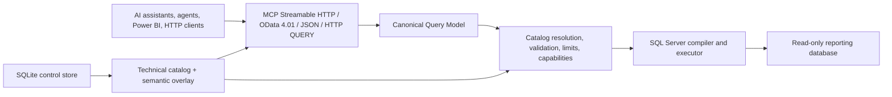

# Architecture

## Status and authority

The complete architectural baseline is [AI Data Gateway — Project Handoff](./AI_DATA_GATEWAY_HANDOFF.md). Its product boundaries, non-goals, security constraints, public contracts, and release sequence are authoritative unless the project owner changes them explicitly.

This document is the concise implementation map. The root-level C# source from the legacy `thesqlodatamcp` proof of concept was removed from `main` after being preserved under the annotated tag `legacy-poc-final-2026-07-18`.

## Target system

`thesqlodatamcp` is a .NET 10 / ASP.NET Core web application. It exposes one read-only query capability through multiple protocol adapters:



Protocol syntax never reaches the provider directly. Every request becomes a versioned CQM document, is resolved against the active catalog, type-checked, limited, and then compiled into exactly one parameterized `SELECT`.

## Architectural boundaries

### Host and protocols

- ASP.NET Core is the runtime host.
- MCP uses Streamable HTTP and the supported official .NET SDK selected at implementation time.
- OData exposes an explicitly limited read-only 4.01 profile with a release-by-release capability matrix.
- JSON and HTTP `QUERY`/`POST` share the same CQM handler.
- GraphQL is post-v1 and must also translate to CQM.

### Query core

- CQM is provider-neutral and strictly versioned.
- The public model cannot represent writes or SQL fragments.
- Expressions, joins, aggregates, grouping, ordering, and paging are structural and type-checked.
- Unsupported behavior is rejected with stable codes and JSON paths; it is never approximated silently.
- MCP and JSON return compact tabular envelopes with columns once and rows as arrays.

### Catalog

- SQL Server metadata is discovered at runtime using `Microsoft.Data.SqlClient`.
- Technical metadata is merged with administrator-authored Markdown and YAML.
- Files are bootstrap/import/export artifacts; the active runtime revision lives in the control store.
- Invalid refreshes never replace the last valid revision.
- Foreign keys are relationship hints. Explicit valid join conditions take priority.
- The technical catalog is provider-neutral, preserves physical identifier casing and provider type details, supports keyless views, and has deterministic canonical JSON and a structural SHA-256 hash.
- SQL Server catalog types are normalized and validated in the provider boundary before entering Core. Supported scalar families preserve meaningful provider details; unsupported or user-defined names remain explicit `unknown` values without inferred metadata.

### Persistence

- The reporting source is accessed directly through ADO.NET, never through EF Core.
- SQLite and EF Core migrations are used only for OpenIddict state, catalog revisions, hashed approval tokens, minimal admin audit, and required cryptographic state.
- v1 is deliberately single-instance because of SQLite.

### Identity and security

- Remote data access requires authentication; anonymous users cannot inspect or query the catalog.
- Standalone v1 OAuth uses OpenIddict, authorization code + PKCE, dynamic public-client registration, refresh/revocation, resource indicators, and reference tokens.
- Administrator access is separate and protects a minimal backoffice.
- The source database identity must be read-only even if application validation fails.
- Identifiers come only from the active catalog and literals are always parameters.
- Timeouts, cancellation, concurrency, row and byte limits, expression complexity, and audit-safe logging are mandatory.

## Target solution boundaries

```text
src/
  TheSqlODataMcp.Core/          Catalog, CQM, validation, abstractions
  TheSqlODataMcp.SqlServer/     Introspection, compilation, type mapping
  TheSqlODataMcp.Persistence/   SQLite, OpenIddict, migrations
  TheSqlODataMcp.Protocols/     MCP, OData, JSON adapters
  TheSqlODataMcp.Web/           Hosting, OAuth, admin, health

tests/
  TheSqlODataMcp.Core.Tests/
  TheSqlODataMcp.SqlServer.Tests/
  TheSqlODataMcp.IntegrationTests/
  TheSqlODataMcp.ProtocolTests/
```

The public product name is final. [ADR 0002](./decisions/0002-dotnet-identifiers.md) defines the corresponding .NET identifier casing; avoid additional projects until a dependency boundary justifies them.

## Legacy proof-of-concept disposition

The former `Program.cs`, `McpTools.cs`, `DqlValidator.cs`, `DatabaseConnector.cs`, settings classes, project file, generated binaries, and tests were not a foundation to harden incrementally:

- they use stdio instead of the target remote Streamable HTTP transport;
- they expose raw SQL conditions and rely on an incomplete blacklist;
- they do not implement OAuth or request authorization;
- their tool discovery is incomplete and their output contracts are unsuitable;
- they do not implement CQM, catalog revisions, OData, JSON API, control store, or operational limits.

The project owner chose to keep this public repository, preserve the final PoC state in `legacy-poc-final-2026-07-18`, and remove the obsolete implementation from `main`. Historical code remains recoverable through the tag and Git history; the QA and handoff documents remain on `main`.

## Implementation baselines

[ADR 0003](./decisions/0003-protocol-identity-catalog-libraries.md) fixes the initial MCP, OData, OpenIddict, Markdown/YAML, and JSON Schema choices validated by executable spikes. [ADR 0005](./decisions/0005-solution-build-and-ci-baseline.md) records their production package placement, the dependency graph, and the shared build and CI policy. [ADR 0006](./decisions/0006-technical-catalog-core-model.md) fixes the initial provider-neutral technical catalog representation and deterministic structural hash. [ADR 0007](./decisions/0007-sqlserver-type-mapping.md) fixes the SQL Server catalog type-mapping and explicit-unknown policy. [ADR 0008](./decisions/0008-sqlserver-introspection-foundation.md) fixes the accepted table/view/column discovery boundary and its real SQL Server regression gate. Proposed [ADR 0009](./decisions/0009-sqlserver-relational-metadata-introspection.md) extends that boundary to keys, useful standalone indexes, and ordered foreign-key relationships while retaining one fixed read-only database command.

The SQL Server disposable integration-test infrastructure is accepted in [ADR 0004](./decisions/0004-sqlserver-test-infrastructure.md). Its pinned owned-Testcontainers path, real connection, typed parameterized query, cleanup assertion, and intended GitHub Actions runner have all passed. Future dependency or image upgrades must repeat that evidence without changing the settled product boundaries.

The reusable test catalog begins with a provider-neutral contract under `tests/fixtures/reporting-catalog/`. Provider directories implement the same logical schemas, relationships, views, and deterministic row counts while keeping engine-specific capabilities separate. The SQL Server implementation resets and seeds a fixed test database, exercises supported and deliberately excluded metadata, and drops only that database after the integration run.

The definitive product/repository name and Apache License 2.0 are recorded in [ADR 0001](./decisions/0001-project-identity.md).
