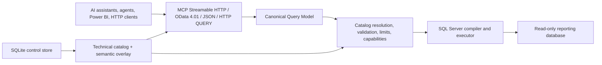

# Architecture

## Status and authority

The complete architectural baseline is [AI Data Gateway — Project Handoff](./AI_DATA_GATEWAY_HANDOFF.md). Its product boundaries, non-goals, security constraints, public contracts, and release sequence are authoritative unless the project owner changes them explicitly.

This document is the concise implementation map. The root-level C# source from the legacy `thesqlodatamcp` proof of concept was removed from `main` after being preserved under the annotated tag `legacy-poc-final-2026-07-18`.

## Target system

AI Data Gateway is a .NET 10 / ASP.NET Core web application. It exposes one read-only query capability through multiple protocol adapters:



Protocol syntax never reaches the provider directly. Every request becomes a versioned CQM document, is resolved against the active catalog, type-checked, limited, and then compiled into exactly one parameterized `SELECT`.

## Architectural boundaries

### Host and protocols

- ASP.NET Core is the runtime host.
- MCP uses Streamable HTTP and the supported official .NET SDK selected at implementation time.
- OData exposes an explicitly limited read-only 4.01 profile with a release-by-release capability matrix.
- JSON and HTTP `QUERY`/`POST` share the same CQM handler.
- GraphQL is post-v1 and must also translate to CQM.

### Query core

- CQM is provider-neutral and strictly versioned.
- The public model cannot represent writes or SQL fragments.
- Expressions, joins, aggregates, grouping, ordering, and paging are structural and type-checked.
- Unsupported behavior is rejected with stable codes and JSON paths; it is never approximated silently.
- MCP and JSON return compact tabular envelopes with columns once and rows as arrays.

### Catalog

- SQL Server metadata is discovered at runtime using `Microsoft.Data.SqlClient`.
- Technical metadata is merged with administrator-authored Markdown and YAML.
- Files are bootstrap/import/export artifacts; the active runtime revision lives in the control store.
- Invalid refreshes never replace the last valid revision.
- Foreign keys are relationship hints. Explicit valid join conditions take priority.

### Persistence

- The reporting source is accessed directly through ADO.NET, never through EF Core.
- SQLite and EF Core migrations are used only for OpenIddict state, catalog revisions, hashed approval tokens, minimal admin audit, and required cryptographic state.
- v1 is deliberately single-instance because of SQLite.

### Identity and security

- Remote data access requires authentication; anonymous users cannot inspect or query the catalog.
- Standalone v1 OAuth uses OpenIddict, authorization code + PKCE, dynamic public-client registration, refresh/revocation, resource indicators, and reference tokens.
- Administrator access is separate and protects a minimal backoffice.
- The source database identity must be read-only even if application validation fails.
- Identifiers come only from the active catalog and literals are always parameters.
- Timeouts, cancellation, concurrency, row and byte limits, expression complexity, and audit-safe logging are mandatory.

## Target solution boundaries

```text
src/
  Gateway.Core/          Catalog, CQM, validation, abstractions
  Gateway.SqlServer/     Introspection, compilation, type mapping
  Gateway.Persistence/   SQLite, OpenIddict, migrations
  Gateway.Protocols/     MCP, OData, JSON adapters
  Gateway.Web/           Hosting, OAuth, admin, health

tests/
  Gateway.Core.Tests/
  Gateway.SqlServer.Tests/
  Gateway.IntegrationTests/
  Gateway.ProtocolTests/
```

Names remain provisional. Avoid additional projects until a dependency boundary justifies them.

## Legacy proof-of-concept disposition

The former `Program.cs`, `McpTools.cs`, `DqlValidator.cs`, `DatabaseConnector.cs`, settings classes, project file, generated binaries, and tests were not a foundation to harden incrementally:

- they use stdio instead of the target remote Streamable HTTP transport;
- they expose raw SQL conditions and rely on an incomplete blacklist;
- they do not implement OAuth or request authorization;
- their tool discovery is incomplete and their output contracts are unsuitable;
- they do not implement CQM, catalog revisions, OData, JSON API, control store, or operational limits.

The project owner chose to keep this public repository, preserve the final PoC state in `legacy-poc-final-2026-07-18`, and remove the obsolete implementation from `main`. Historical code remains recoverable through the tag and Git history; the QA and handoff documents remain on `main`.

## Decisions still open at implementation time

The following choices are intentionally not frozen by the handoff:

- final product, assembly, and namespace names; the existing public repository is retained and may be renamed later;
- exact supported package versions;
- ASP.NET Core OData runtime-EDM approach on .NET 10;
- JSON Schema and YAML libraries;
- SQL Server disposable integration-test infrastructure.

These choices may change implementation detail, but not the settled product boundaries.

The repository license is Apache License 2.0.
